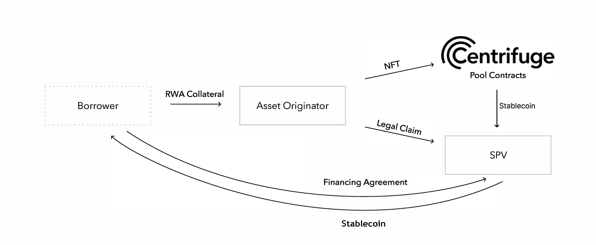

## Offering Structure

_Disclaimer: This is not legal advice. The information provided here is solely for informational purposes. We recommend you consult a lawyer if you want legal advice. No attorney-client or confidential relationship exists or will be formed between you and any contributors to Centrifuge.
This article describes the legal structure at a high level and provides boilerplate legal agreements as an example for how to set up the legal framework necessary to ensure Real World Assets can be tokenized and a legal recourse exists for anyone holding these tokens._

The legal setup for each pool mirrors the Centrifuge smart-contract structure and the real-world relationships between the parties. It is structured with two goals in mind:

1. Ensure that investors in the pool have the most protection possible giving them recourse to the RWA used as collateral in the pool.
   The source of truth is on-chain. The legal contracts delegate all possible responsibilities to the on-chain smart contracts.
2. For this purpose, each pool has a legal entity tied to it, special purpose vehicle or SPV. The SPV keeps the Asset Originator's business separate from the financing activity in the pool.

This article explores the current template for a general-offering structure, and was developed for US-based offerings. It is the simplest and most straightforward offering structure but is continuously being developed in cooperation with law firms that have a background in international asset-backed financing, security laws, and token, crypto, and virtual/digital assets regulations.

Work is also being done to bring offering structures for other non-US jurisdictions. The outlined structure supports either a 506(b) or a 506(c) offering under Regulation D of the US Securities Act of 1933 for a US-based issuing SPV offering investments directly to either US investors with accredited investor status or non-US investors domiciled in jurisdictions with United States Income Tax Treaties under the Foreign Account Tax Compliance Act (FATCA).

### What is an SPV?

A Special Purpose Vehicle (SPV) is an independent legal entity. It has its own assets and liabilities, as well as its own legal status. Usually, SPVs are created for a specific objective, often to isolate financial risk. As an SPV is a separate legal entity, it carries even if its parent company goes bankrupt. [Read more](https://corporatefinanceinstitute.com/resources/knowledge/strategy/special-purpose-vehicle-spv/)

## Overview of a Transaction

### Asset Finance Flow

The general flow of financing typically looks as follows:

1. The Asset Originator sets up a legal entity - a special purpose vehicle - for each pool. The SPV keeps all financings remote and separate from the Asset Originator.

2. The Borrower wishes to finance an asset such as an invoice or a property.

3. The Asset Originator originates this RWA. The AO has a business relationship with the borrower and performs the underwriting. It then verifies the RWA and mints an NFT for the asset to be used as collateral on-chain.

4. The Borrower enters into a financing agreement with the SPV and asks the Asset Originator to lock its NFT in the Centrifuge pool tied to the SPV. As the NFT is locked in Centrifuge, DAI is drawn from the Centrifuge pool reserve, and either directly transferred to the Borrower's wallet or the SPV's wallet, which exchanges DAI for USD and does a bank transfer to the Borrower’s bank account. The SPV is set up in order to keep all financings remote and separate from the Asset Originator. Bankruptcy of the Asset Originator does not impact the SPV and therefore does not impact the financing. All financing transactions and payments are done directly between Borrowers, the SPV, and Investors and happen on-chain in Centrifuge. The SPV is a pass-through entity without the aim to generate profits. It has no employees. Its sole purpose is to finance specific RWAs as underlying assets of one specific Centrifuge pool. The SPV administers this pool and all its services are performed by third parties, upon instruction by the SPV, for a service fee. 

5. The Borrower pays back the financing amount plus the financing fee at the maturity date of the NFT. This happens either directly on-chain in DAI, or the Borrower does a USD bank transfer to the SPV. The SPV exchanges USD for DAI and pays it to the Centrifuge pool. The full repayment of the NFT unlocks the NFT, which is then returned to the Asset Originator where it can be burned.

### Investors

Investors can join a pool and provide liquidity for assets to be financed. They go through the following process.

1. Investors can purchase either Senior or Junior ERC20 tokens issued by a Centrifuge pool. They need to go through a Know Your Customer and Anti-Money Laundering (KYC/AML) process. This process is handled by the Asset Originator on behalf of the SPV. To learn more about our KYC and onboarding process please review our [Investor Onboarding Guide](https://docs.centrifuge.io/user-documenation/onboarding/)
2. Once KYC’ed, investors should review the pool's executive summary and subscription agreement and sign to invest in the pool. Each pool tranche has its own subscription agreement and investors will only be prompted to sign the agreement for the tranche they are onboarding for. The subscription agreement outlines the general structure, risks, terms and conditions for investment. An additional pool-specific Executive Summary outlines the specifics of the Asset Originator, the SPV, and the underlying financed assets.
3. The SPV as the issuer of Senior and Junior Tokens is countersigning the subscription agreements and whitelists the registered investor wallet address in Centrifuge.
4. The Investor can now invest [on Centrifuge](https://app.centrifuge.io/pools) in the pool of their choice simply by purchasing the Senior or Junior tokens with the stablecoin denomination of the pool (typically DAI, USDC, or USDT).
5. Investors can request a redemption of their Senior or Junior tokens at any time subject to the provisos that Senior tokens have redemption priority over Junior tokens and Junior token investments must not drop below the minimum Junior buffer set for the pool. The redemptions are executed pro-rata between the addresses requesting a redemption on a best-effort basis. All repayments from the underlying assets (NFTs) will be used for open redemption requests before they can be recycled to finance new assets (NFTs). This means a pool stops to finance new assets if redemptions exceed investments. The pool is forced by its investors into liquidation by the Centrifuge smart contracts with all Senior investors treated equally.

## Legal Contract Templates

Centrifuge Pool uses the following templates to achieve the above described setup.

- [Operating Agreement](https://drive.google.com/file/d/1tSdZHCT7cqjh0uKCOqgrCvA9yp7XSY4K/view?usp=sharing): describes the SPVs operation
- [Senior Subscription Document](https://drive.google.com/file/d/1GhTrd6x1OS8KzR9NErFngSZAT737tRLj): The subscription agreement outlines the general structure, risks, terms and conditions of a Senior investment.
- [Junior Subscription Document](https://drive.google.com/file/d/1hXS1jrHSedJwFlV7u2pYPIcv89DYUpk0): The subscription agreement outlines the general structure, risks, terms and conditions of a Junior investment.
