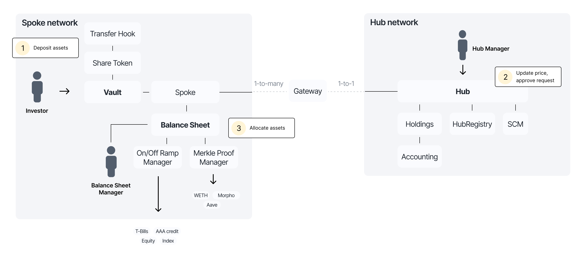
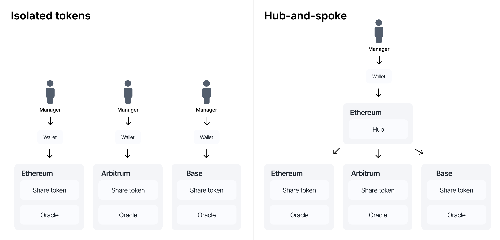

# Hub and Spoke Model

Centrifuge V3 uses a **hub-and-spoke architecture** to make tokenized asset management scalable and chain-agnostic. Instead of issuing and managing separate tokens on every chain, each pool operates from a single control point—the **hub chain**—and can deploy vaults and tokens on any number of **spoke chains**.

This design enables secure and efficient multi-chain operations without duplicating infrastructure or fragmenting accounting.

## How it works

Each Centrifuge pool selects one **hub chain**. This is where:

- Investment requests are coordinated
- Net Asset Value (NAV) is managed
- Vault logic is authorized and validated
- Cross-chain messages are approved

From this hub, the pool can issue tokens and accept investments on multiple **spoke chains** like Ethereum, Arbitrum, Base, and others.

On each spoke chain:

- Investors interact with vaults (ERC-4626 or ERC-7540)
- Assets are deposited or redeemed
- Share tokens are minted or burned
- Liquidity can be routed to DeFi or offchain strategies

Vaults on spoke chains are fully programmable and can be configured for synchronous or asynchronous flows.

As an **investor**, you can interact with a vault on any chain where it has been deployed—without needing to know where the pool is managed from.

As a **pool manager**, you choose the hub chain and deploy to spoke chains that match your goals—whether it’s deep liquidity on Ethereum, low fees on Base, or access to specific protocols on Arbitrum.
On each spoke chain:

## The problem with isolated token deployments

Most protocols issue tokens independently on each chain, creating siloed ecosystems.

Each token must be managed separately—with its own oracle, wallet, and accounting. This leads to operational overhead, duplication of effort, and fragmented liquidity.

In contrast, Centrifuge’s hub-and-spoke architecture allows a single control point (the Hub) to coordinate tokens, vaults, and oracles across all supported networks.

This unlocks seamless multi-chain expansion while keeping the logic and state consistent.

## Hub responsibilities

The **Hub chain** acts as the central coordination layer. It manages:

- **Accounting** and NAV for all vaults and share classes
- **Price oracles** and asset valuation
- **Request approval** for deposits and redemptions
- **Registry management** (Holdings, HubRegistry, SCM)

Pool managers primarily interact with the hub to control the pool’s logic and state.

## Spoke responsibilities

**Spoke chains** are where users and capital interact directly. On a spoke:

- Investors deposit and redeem assets
- Share tokens are issued or burned
- Assets are allocated via balance sheet logic
- DeFi strategies can be integrated locally

Each spoke operates autonomously for users, but defers control logic to the hub.

## Behind the scenes: cross-chain communication

Centrifuge includes a messaging system between the hub and spoke chains. It handles:

### Multi-message aggregation  
Messages are verified using multiple interoperability providers to improve cross-chain security.

### Message batching  
Multiple requests are bundled into a single proof to reduce gas costs and transaction count.

### Gas abstraction  
Users don’t need native gas tokens on spoke chains. Pools can subsidize gas, and Centrifuge relays funds automatically between chains.

### Retries and repayments  
If a cross-chain message fails or runs out of gas, Centrifuge automatically retries it or allows repayment with no manual intervention.

## Summary

Centrifuge’s hub-and-spoke model enables:

- **Single-point control** over multi-chain tokenization
- **Seamless vault deployments** across supported EVM chains
- **Unified accounting** and capital coordination
- **Better UX** for both investors and managers

This architecture powers scalable, composable asset management—without chain silos or operational overhead.