# Issuer guide

Centrifuge gives issuers and asset managers an onchain operations platform for financial products. The issuer structures the offering and the Centrifuge management app becomes the onchain management path for it: issuance, investor access, pricing, distribution and reporting, operated from one interface.

The protocol abstracts the contract-level complexity. Issuers don't write or deploy code; they operate the product through the app, with the kind of controls expected from traditional fund infrastructure.

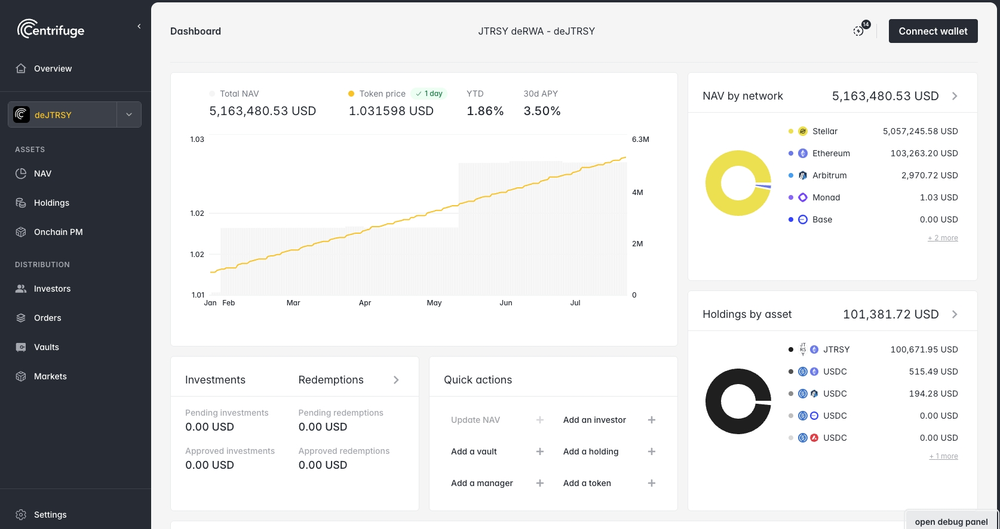
> Product page with key facts and performance information.

## What issuers can build

The platform is flexible enough to represent very different product structures:

- **Tokenized funds** — money market, treasury, credit, fixed income, equity or other pooled vehicles, where the token represents a share of the fund.
- **Funds with multiple share classes** — one product with several tokens, each with its own terms, currency or investor base.
- **DeFi-native yield tokens** — freely transferable tokens designed to circulate in DeFi: tradable on exchanges, usable as collateral, composable with other protocols.
- **Purely onchain strategies** — products with no offchain leg, where a curator allocates capital across onchain venues.
- **Blended portfolios** — products that combine onchain and offchain assets in one structure.
- **Products that invest in other products** — fund-of-funds style structures, where one pool subscribes to the share tokens of another.
- **Multi-currency products** — a single token investable with different currencies.

These are patterns, not fixed templates: access rules, currencies, liquidity terms and operational roles are configured per product.

## The offering, onchain

Creating a product in Centrifuge is not primarily a technical act — it is the onchain reflection of a structure the issuer has set up offchain. For purely onchain strategies, it is the structure itself.

That reflection is the pool. The pool represents the product's onchain management: it holds the balance sheet, defines the share classes, and is the place from which the issuer controls operations — investors, orders, pricing, liquidity. Everything in the rest of this guide happens within a pool.

Pools are currently set up through an authorized onboarding process. Once registered onchain, they appear in the management app, where issuers configure and operate the product’s share classes, tokens, vaults, investor access, pricing and distribution.

## Token management

### The token is the ownership layer

Each share class of the pool is represented by a token. The token is what investors hold, what carries the price, and what moves: it can be distributed to multiple chains and — depending on how the issuer configures it — traded or sold on DeFi protocols.

A pool can have a single token or several, each with its own terms.

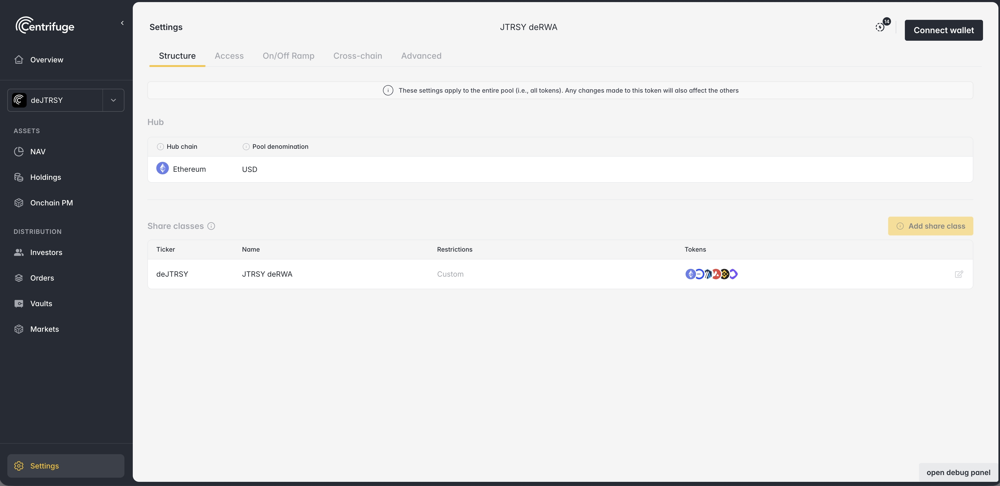
> Settings section to manage products and share classes

The issuer can view and modify the token details of the product.
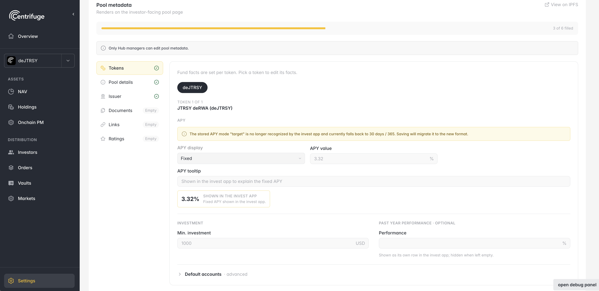
> Advanced settings section with token details.

### Transfer restrictions

Subscription, redemption and transfer permissions are three configurable dimensions applied per token. This makes very different distribution models possible on the same infrastructure. Common restriction profiles include:

- **Fully restricted** — subscription, redemption and transfers all require the whitelist. Transfers only settle if the receiver is whitelisted too. The classic institutional fund share.
- **Transferable but gated** — the whitelist applies to subscriptions and redemptions, while transfers are unrestricted. Where integrations and liquidity are available, the token can be traded or used as collateral in DeFi. Redemption against the pool still requires the holder to be whitelisted.
- **Redemption gated** — subscription and transfers are open; only whitelisted investors can redeem.
- **Open with freeze controls** — operations are open, and the issuer retains the ability to freeze specific addresses if required.

These controls are not fixed at launch — permissions can be updated from the app as the offering evolves. Who is on the whitelist is a separate, day-to-day operation: see [Investor management](#investor-management).

### Distributing the token across chains

A share token can be deployed across multiple networks while remaining part of the same share class. From the Management app, issuers can view its existing deployments and extend distribution to additional networks. The protocol handles the underlying crosschain coordination, maintaining a unified supply and consistent price for the share class across its deployments.

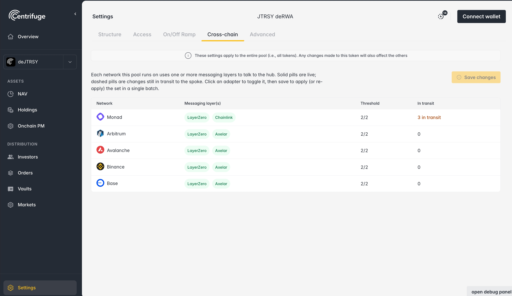
> Cross-chain section.

### Vaults: managing the product's entry points

A vault is an entry point the issuer opens into the pool. When creating a vault, the issuer decides which investment asset it accepts, on which network it lives, and how execution works:

- **Instant execution** — deposits settle immediately, with tokens minted in the same transaction. Suited to liquid strategies. For these vaults, the issuer sets a deposit capacity that bounds how much liquidity the vault accepts.
- **Request-based execution** — deposits become orders that the issuer processes at the product's cadence. Suited to products with offchain settlement or periodic valuation.

Redemptions are processed through requests on every vault type — only deposits can settle instantly. This allows redemptions to be processed according to the product’s liquidity and settlement terms.

From the app, the issuer manages the product's entry points over its whole life:

- Add vaults as distribution grows — a new accepted currency, or a new network. To distribute the token to investors on another chain, the issuer deploys a vault there.
- Enable or disable a vault to open or pause entry through it, without affecting the rest of the product.
- Adjust the deposit capacity of instant vaults as the strategy's liquidity changes.

Several vaults can serve the same token — for example one per currency, or one per chain — and each is managed independently.

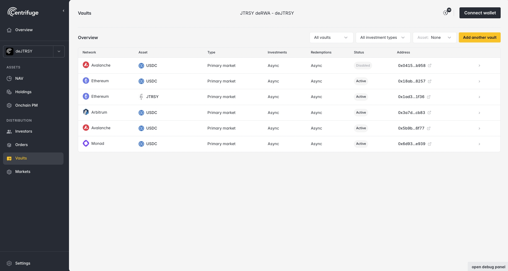
> Vaults section.

### Pricing (NAV)

Each token’s price is derived from the value allocated to its share class and the product’s established valuation methodology. The issuer records and publishes valuation updates through the Management app, and the protocol propagates them across every network where the token is distributed.

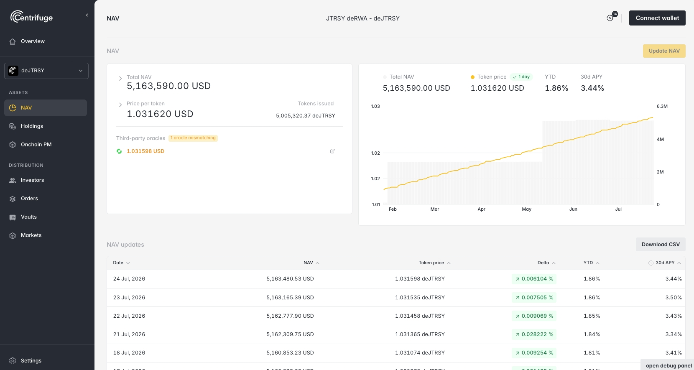
> The NAV section of the app.

## Asset and liquidity management

Additional assets can be registered for use in the pool's balance sheet and operational flows. A registered asset can become an investor entry point when the issuer deploys a vault that accepts it (see [Vaults](#vaults-managing-the-products-entry-points)).

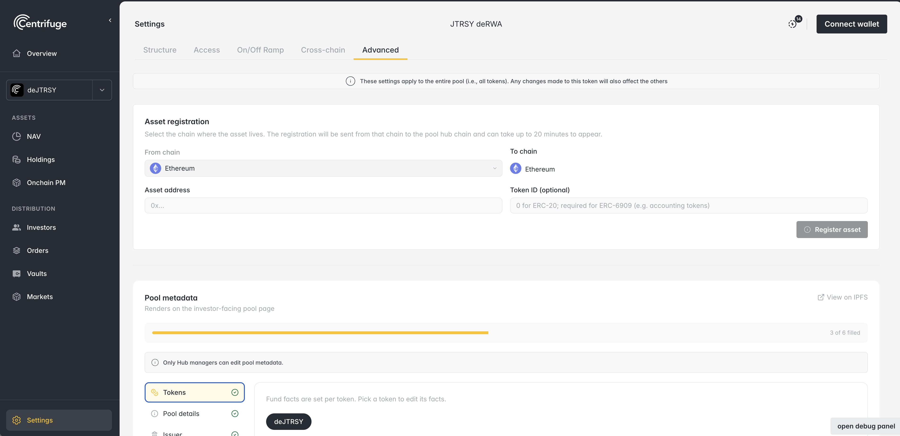
> Asset registration section.

Issuers can also configure how assets move in and out of the product: the assets accepted by on/off-ramp flows, the relayers authorized to operate them, and the addresses that may receive withdrawals. These controls are separate from vaults. Vaults define how investors subscribe and redeem, while on/off-ramp configuration supports the issuer’s balance sheet and settlement operations.

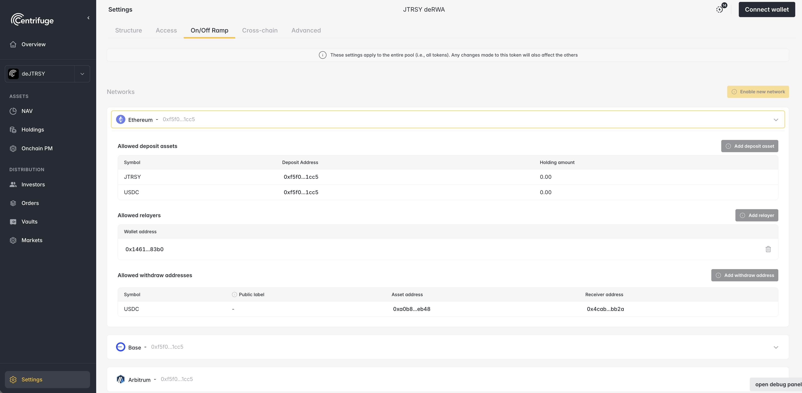
> Settings On/Off Ramp section.

## Roles and permissions

Operating a product is a team effort, and the pool separates duties into distinct administrative roles. All of them are granted and revoked from the app's access settings, and every change takes effect onchain:

- **Hub managers** — full control over the pool's configuration: tokens, permissions, pricing and the other roles. The top-level administrators of the product.
- **Balance sheet managers** — authorized to move the product's assets in and out of the pool's balance sheet. Granted per network, so operational reach can be scoped to where each operator works.
- **Policy-based managers and operators** — contract-based operators, such as merkle proof managers and onchain portfolio managers, that execute pre-approved operations within limits defined by the issuer (see [Operational flexibility and automation](#operational-flexibility-and-automation)).

This separation keeps day-to-day operations away from top-level control: an operator can run the product's routine flows without being able to change its configuration.

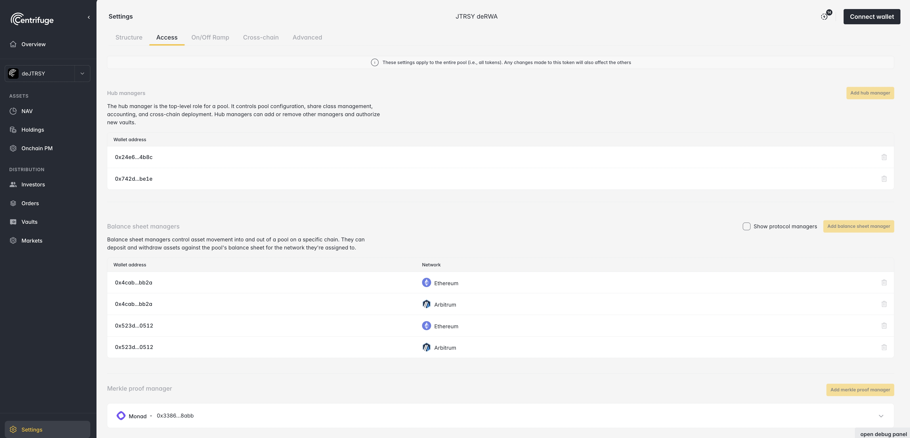
> Settings access section showing the managers of a pool.

## Investor management

For permissioned products, the issuer controls which addresses can subscribe and redeem. Onboarding an investor — after the KYC/AML or eligibility process the offering requires — ends with adding their address to the product's whitelist in the app. The addition takes effect onchain on the selected networks, and access is granted per network: an investor approved on one network is not automatically approved on the others.

Beyond adding investors, the app works as the operational console for the investor base:

- View investors and their holdings per network, with search and filters by network and status.
- See each investor's queued and pending investments and redemptions.
- Add several investors at once and label addresses to identify them easily in the app.
- Add or remove addresses from the whitelist as the offering requires.
- Freeze and unfreeze accounts when intervention is needed.
- Review an investor's transaction history, and export investors and transactions to CSV for reporting.

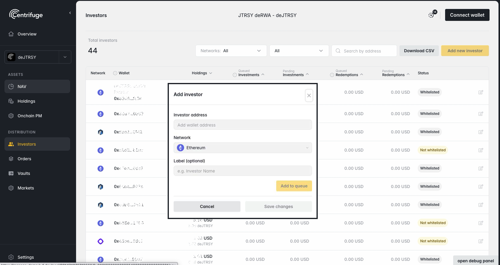
> Investors view with the option to add new investors.

## Investment operations

For request-based vaults, the Management app gives issuers visibility and control over the full order lifecycle:

1. An investor submits a subscription or redemption request.
2. Pending requests are visible with their investor, network, amount and status.
3. The issuer approves and executes requests according to the product's settlement cadence.
4. Investors claim their share tokens or redemption assets.

For instant-execution vaults, deposits settle without issuer intervention. Redemptions remain request-based.

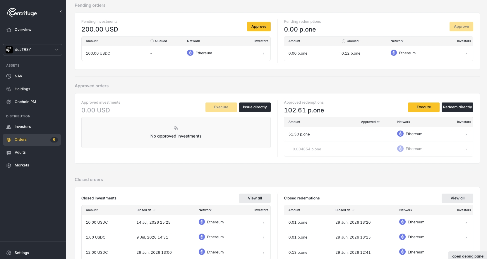
> Orders section with pending investments and redemptions.

## Operational flexibility and automation

The platform provides an onchain portfolio management layer for repeatable, pre-approved operations, such as subscribing into other onchain products, moving liquidity between chains and updating accounting prices.

A manager defines the permitted actions and guardrails — such as slippage protection — while an authorized operator executes the workflows within those boundaries. Everything runs onchain, within limits set from the UI.

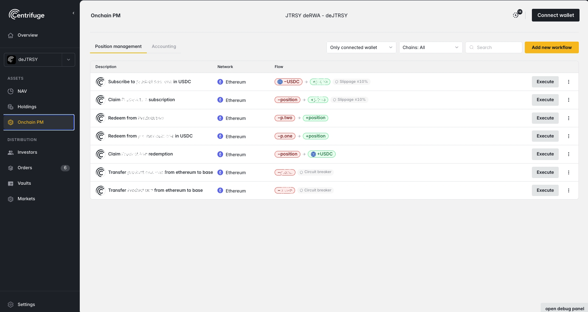
> OnchainPM workflows section.

## Why issuers choose Centrifuge

- **One interface for the whole lifecycle** — issuance, investors, pricing, orders, liquidity and distribution are operated from the same app.
- **Complexity is abstracted** — multichain distribution, permissioning and price propagation are platform capabilities, not engineering projects.
- **Controls that meet institutional requirements** — whitelisting, transfer restrictions, freeze capability, role separation and order-based liquidity management.
- **DeFi reach when needed** — the same product can stay fully permissioned or extend into open DeFi distribution, on the issuer's terms.

Issuers evaluating Centrifuge for a product can reach out through [centrifuge.io](https://centrifuge.io) to discuss their structure.
