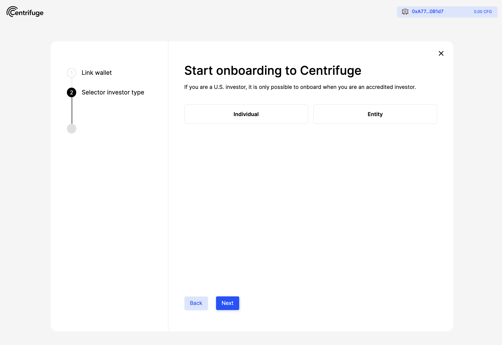
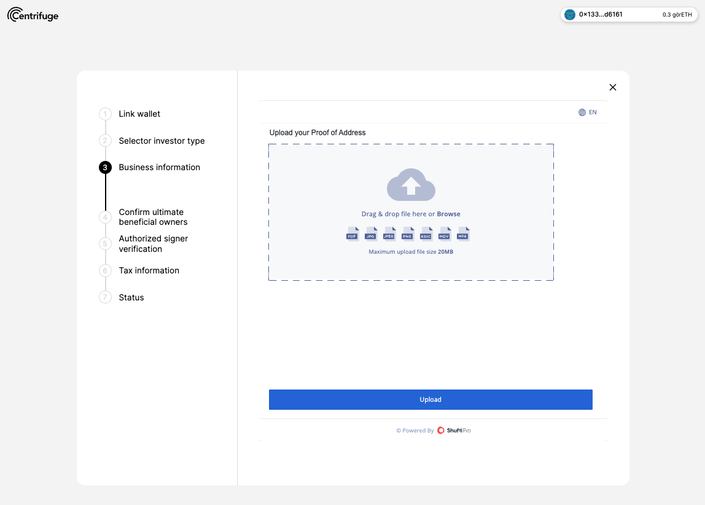
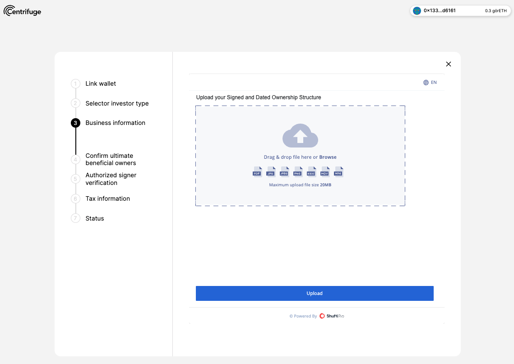
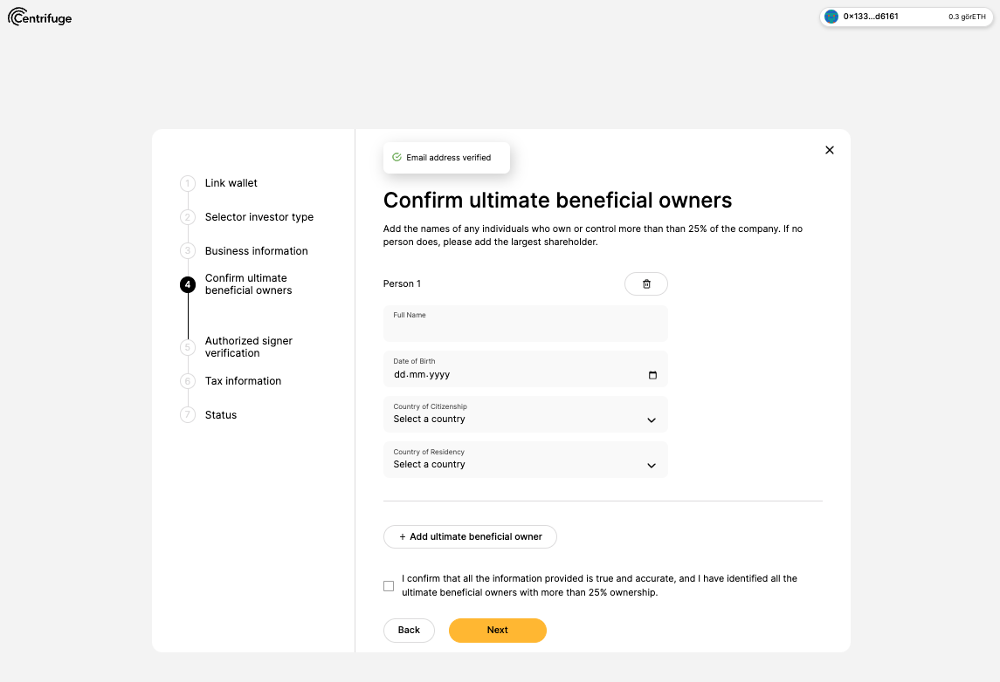

# . 

## Introduction
Investing in Centrifuge requires onboarding as an investor to each specific pool. Submitting personal information for KYC and signing a subscription document with the pool's issuer usually takes 5-7 minutes, but it can take 1-2 days when the country of citizenship or country of incorporation is not supported by the automated onboarding. 

**Onboard as investor:** Onboarding as an investor is a one-time step to verify personal information for KYC ("Know your customer") through the Centrifuge onboarding flow powered by [Shufti Pro](https://shuftipro.com/). Once an investor is onboarded, they are eligible to invest in any open pool.

**Onboard to a pool:** Onboarding to a pool requires signing a subscription agreement with the pool issuer. Once the agreement has been signed by both parties, and the issuer approves the investment request, the investor can place an investment into the pool. 

## Requirements

### Onboarding as an individual requires:

* Ethereum wallet, e.g. Metamask, Wallet Connect, Coinbase Wallet (for Ethereum-based pools)
* Centrifuge Chain wallet e.g. Talisman, SubWallet or Polkadot.js (For Centrifuge-based pools)
* Valid email address
* A passport or government-issued photo ID
* Proof of address (e.g. utility bill, phone bill or council tax bill, not older than 3 months)
* Completed Form W-8BEN (individuals based outside US), Form W9 (U.S. citizen or U.S. person & US entity)

### Onboarding as an entity requires:
* Ethereum wallet, e.g. Metamask, Wallet Connect, Coinbase Wallet (for Ethereum-based pools)
* Centrifuge wallet e.g. Talisman, SubWallet or Polkadot.js (For Centrifuge-based pools)
* Valid email address
* Legal entity name, Country of incorporation, Registration number
* Proof of address of the entity (for manual onboarding)
* Signed and Dated Ownership Structure (for manual onboarding)
* Names, date of birth, country of citizenship and country of residency of ultimate beneficial owners
* A passport or government-issued photo ID of the authorized signer
* Proof of address (e.g. utility bill, phone bill or council tax bill, not older than 3 months) of the authorized signer
* Completed Form W-8BEN-E (businesses based outside the US) or Form W9 (U.S. citizen or U.S. person & US entity)

### Onboarding to a pool requires:

* Ethereum or Centrifuge wallet
* A verified KYC (i.e. a completed onboarding as an investor)

Good to know: Don’t worry if you can’t finish the process in one go – you can always leave the onboarding flow and continue later where you’ve left off before.

### Further requirements
* US investors need to be accredited investors to invest in pools. See section **Onboarding as US investor** below.
* Due to US sanctions, investors from certain countries are excluded from investing. See section **Excluded Countries** below.

## Onboarding as an individual  

Start the onboarding flow to become a KYC-verified investor before onboarding to a pool later. Once you have connected your wallet, click `Verify identity` in the wallet dropdown and start the onboarding flow.

**1. Connect and link wallet**

Connect the Ethereum or Centrifuge address you want to use depending on the pool and sign the transaction. 

**2. Select investor type**

Choose to onboard as an individual. 

**3. Signer verification**

Enter a valid email address and personal data to complete the onboarding process. The verification of the signer is powered by Shufti Pro.

**3.1 Upload ID**

**3.2 Upload Proof of address and confirm address**

**3.3 Face verification**

**4. Confirm email address**

**5. Upload tax information**

Confirm email address by clicking the verification link in the email. Depending on the location of the signer one of the following documents will be required:
* W-8BEN - individuals based outside US.
* W9 - U.S. citizen or U.S. person & US entity.

**5. Identity is verified**

The global onboarding process is now completed. Now it's time to browse the open pools for investment.

## Onboarding to pool as an individual 

Once you have selected a pool, choose a tranche to invest in, click on `Invest`, the slide over will pop up and click on `Onboard to [token name]` to start the process to onboard as an investor to a specific tranche.

**1. Connect wallet**

If the wallet is disconnected, reconnect and continue where you left off. Connect to an Ethereum or Centrifuge address depending which chain is supported by the pool.

**2. Sign subscription agreement with issuer**

Since your identity is already verified and tax information is uploaded, the next step is the on-chain signature of the subscription agreement. Make sure to have some ETH in your wallet to sign the transaction.

*Read the subscription agreement and click the box below to automatically e-sign the subscription agreement. You don't need to download and sign manually.*

**3. Onboarding almost complete.**

Your documents and profile have been sent to the issuer for approval. You will receive an email once the issuer has approved your documents and countersigned the agreement. 

After the issuer approves the investment request, the investor receives an email and can now invest into the pool.

## Onboarding as an entity

The first two steps are identical to the steps shown in the individual onboarding flow. 

**1. Connect and link wallet**

Connect the Ethereum or Centrifuge address you want to use depending on the pool and sign the transaction. 

**2. Select investor type**

Choose to onboard as an entity. 

**3. Provide information about your business**

Enter a valid email address that you can access, legal entity name, country of incorporation and the registration number. If the entity is incorporated in one of the  [countries on this list](https://api.shuftipro.com/api/docs/#jurisdiction-codes) you can skip to step 4. The verification of the entity is powered by Shufti Pro.  

**3.1 Upload Entity's Proof of Address**

**3.2 Upload Signed and Dated Ownership Structure**

**4. Confirm email address**

Confirm email address by clicking the verification link in the email. 

**5. Confirm ultimate beneficial owners**

Add the names of any individuals who own or control more than than 25% of the company. If no person does, please add the largest shareholder.

**6. Authorized signer verification**

Add the information of the authorized signer (person who controls the wallet) to complete verification. The verification of the authorized signer is powered by Shufti Pro. This step is identical to individual signer verification.

**6.1 Upload ID of authorized signer**
**6.2 Upload Proof of Address of authorized signer**
**6.3 Face verification of authorized signer**

**7. Upload tax information** 

Depending on the location of the entity one of the following documents will be required:

[W-8BEN](https://www.irs.gov/pub/irs-pdf/fw8ben.pdf) - individuals based outside US
[W-8BEN-E](https://www.irs.gov/pub/irs-pdf/fw8bene.pdf) - businesses based outside the US
[W9](https://www.irs.gov/pub/irs-pdf/fw9.pdf) - U.S. citizen or U.S. person & US entity

**8. Entity and authorized signer is verified**

The global onboarding process is now completed. If the entity is not incorporated in one of the [countries on this list](https://api.shuftipro.com/api/docs/#jurisdiction-codes), you need to wait for manual approval by the service provider Shufti Pro. This might take 1-2 days. You will receive an email when your verification was successful or declined.

## Resources

This section covers further information about:
* Onboarding as an US investor / Accredited Investor
* Excluded countries
* Data sharing policy
* Terms and conditions
* Investment disclaimer

### Onboarding as an US investor

To invest in Centrifuge as an US investor you need to be an "Accredited Investor".

#### What is an "Accredited Investor"?
An accredited investor is an individual or a business entity that is allowed to trade securities that may not be registered with financial authorities such as the SEC. They are entitled to this privileged access by satisfying certain requirements regarding their income, net worth, asset size, governance status or professional experience. In the U.S, the definition of an accredited investor is put forth by [SEC in Rule 501 of Regulation D](https://www.ecfr.gov/current/title-17/chapter-II/part-230/subject-group-ECFR6e651a4c86c0174/section-230.501).

The regulations for accredited investors vary from between jurisdictions but require that a person:

- Any natural person whose individual net worth, or joint net worth with that person's spouse or spousal equivalent, exceeds $1,000,000;
- Any natural person who had an individual income in excess of $200,000 in each of the two most recent years or joint income with that person's spouse or spousal equivalent in excess of $300,000 in each of those years and has a reasonable expectation of reaching the same income level in the current year; 
- Be a general partner, executive officer, or director for the company that is issuing the unregistered securities or
- Be a registered brokers and investment advisor

#### What information do I need to provide as accredited investor?

If you are an US investor you further need to provide documentation to prove you are an `Accredited Investor`. You will need to complete a questionnaire as part of the onboarding flow.

## Excluded countries
Unfortunately, due to US sanctions, investors located in or a resident of the following countries are currently blocked from investing in Centrifuge:

* Cuba
* Iran
* North Korea
* Syria
* Belarus
* Congo, Democratic Republic of
* Iraq
* Libya
* Nicaragua
* Russia
* Ukraine 
* Somalia
* Sudan
* Venezuela
* Zimbabwe

### Data sharing policy

**Consent to data transfer**
Shufti Pro Limited enables Investors to disclose their personal data to issuers of such Investors' choosing. Investors located in the European Economic Area ("EEA") or the United Kingdom should be aware that these disclosures may involve transfers to countries that do not provide the same level of protection for personal data as their home countries. Please note that this Data Transfer Consent Form should be read in conjunction with our GLBA Privacy Notice and (for EEA and UK residents) our GDPR Privacy Notice. Any defined terms not defined herein take their meaning from those notices or the Shufti Pro Terms and Conditions. The below information contains key details regarding these transfers:

**Controllers' Identities**
Shufti Pro Limited and its wholly-owned subsidiaries ("Shufti Pro") and the issuer(s) to which you authorize the transfer.

**Purpose of Transfer**
Shufti Pro will access and transfer your personal data to the issuer(s) you identify. One or more issuer may be located in the United States or in other jurisdictions outside the EEA or the United Kingdom.

**What type of data will be disclosed?**
Shufti Pro will disclose your personal data stored in your account for the purpose set forth above. That information includes each category of personal data identified in the GLBA Notice or GDPR Notice, as applicable.

**Withdrawal of Consent**
Shufti Pro only facilitates the initial disclosure to the issuers that you have affirmatively selected. Should you no longer want to communicate with a particular issuer after consenting to the disclosure discussed herein, or if you wish that issuer to delete the personal data it has been provided pursuant to this consent, please contact that issuer directly.

**Risks of Data Transfer**
By consenting to this disclosure, your information will be transferred to the country in which the particular issuers you have selected are located. ***According to EEA regulations, the United States does not provide an "adequate" level of protection for purposes of data protection, and no alternative safeguards are in place for this particular transfer. Further, the issuer you have selected may be located in the United States or in another country that does not provide such adequate levels of protection or safeguards. As such, your information may be at risk of unauthorized or unwanted access.
***Please note, however, that Shufti Pro takes the security of your information seriously and implements organizational and technical measures to ensure a level of security for your personal data appropriate to these risks.

**Your Consent**
By consenting to the data transfer, you acknowledge you have read and consent to the transfer of your personal data as set forth herein. You may decline to consent to this transfer, in which case Shufti Pro will not be able to carry out your direction to disclose your personal information to your selected issuer.

### Terms and conditions

The information to which this website gives access is exclusively intended for persons who are not located in or resident of certain other restricted jurisdictions, and who are otherwise permitted to receive such information under applicable law.

The information to which this website gives access does not constitute an offer or an invitation to purchase securities in any other jurisdiction in which such offer or invitation is not authorized or to any person to whom it is unlawful to make such offer or invitation. An investment in will be characterized by a high degree of risk, volatility and illiquidity. A prospective investor should thoroughly review the confidential information contained herein and the terms of the relevant agreements, and carefully consider whether such an investment is suitable to the investor’s financial situation and goals.

Certain economic and market information contained herein has been obtained from published sources prepared by other parties. While such sources are believed to be reliable, neither nor any of its affiliates assume any responsibility for the accuracy or completeness of such information. Neither delivery of this information nor any statement herein should be taken to imply that any information contained herein is correct as of any time subsequent to the date hereof.

No person has been authorized to make any statement other than as set forth in the applicable offering documents, and any such statements, if made, must not be relied upon. Prospective investors are cautioned not to rely on any prior return information set forth herein in making a decision whether or not to invest. Any return information contained herein has not been audited or verified by any independent party and should not be considered representative of returns that may be received by an investor in . Certain factors exist that may affect comparability including, among others, the deduction of costs and service fees. Certain factual and statistical information contained herein has been obtained from published sources prepared by other parties and has not been independently verified by the issuer. Opinions and estimates may be changed without notice.

Certain statements of past performance, and certain economic and market information, contained herein includes projections and estimates made by and other parties. Any projected returns and estimates of economic and market information contained herein involve risks and uncertainties and are based on assumptions concerning circumstances and events that have not yet occurred and may be subject to being influenced by events beyond the control of the issuer. Actual results could differ significantly. No representation or warranty, express or implied, is made by the issuer. As to the reasonableness or accuracy of the projections or estimates and, as a result, such projections and estimates should be viewed solely as an orderly representation of estimated results if underlying assumptions are realized. Investors should subject the projections and estimates to review by their own professional advisers.

In considering the prior performance information contained herein, prospective investors should bear in mind that past performance is not necessarily indicative of future results, and there can be no assurance that will achieve comparable results. Prospective investors should make their own investigations and evaluations of the issuer, including the merits and risks involved in an investment therein. Prior to any investment, investors will have the opportunity to ask questions of and receive answers and additional information from concerning the terms and conditions of this offering and other relevant matters to the extent possesses the same or can acquire it without unreasonable effort or expense. Prospective investors should inform themselves as to the legal requirements applicable to them in respect of the acquisition, holding and disposition of the investment, and as to the income and other tax consequences to them of such acquisition, holding and disposition.

This information does not constitute an offer to sell, or a solicitation of an offer to buy, an interest in any jurisdiction in which it is unlawful to make such an offer or solicitation. Neither the United States Securities and Exchange Commission nor any other federal, state or foreign regulatory authority has approved an investment. Furthermore, the foregoing authorities have not confirmed the accuracy or determined the adequacy of this information, nor is it intended that the foregoing authorities will do so. Any representation to the contrary is a criminal offense.

Certain statements herein constitute forward-looking statements. When used herein, the words “may,” “will,” “should,” “project,” “anticipate,” “believe,” “estimate,” “intend,” “expect,” “continue,” and similar expressions or the negatives thereof are generally intended to identify forward-looking statements. Such forward-looking statements, including the intended actions and performance objectives of involve known and unknown risks, uncertainties, and other important factors that could cause the actual results, performance, or achievements of to differ materially from any future results, performance, or achievements expressed or implied by such forward-looking statements. No representation or warranty is made as to future performance or such forward-looking statements. All forward-looking statements herein speak only as of the date hereof. The issuer expressly disclaims any obligation or undertaking to disseminate any updates or revisions to any forward-looking statement contained herein to reflect any change in its expectation with regard thereto or any change in events, conditions, or circumstances on which any such statement is based.

Prospective investors are not to construe this information as investment, legal, tax, regulatory, financial, accounting or other advice, and this information is not intended to provide the sole basis for any evaluation of this investment. Prior to acquiring an interest, a prospective investor should consult with its own legal, investment, tax, accounting, and other advisors to determine the potential benefits, burdens, and other consequences of such investment. By proceeding to view the materials to which this website gives access, you agree that you will not transmit or otherwise send any information to which this website gives access to any person in any jurisdiction in which the distribution of such information is restricted, or in which the offer or invitation to purchase tokens proposed to be issued by is not authorized, or to whom such offer or invitation may be unlawful.

If you are located in, or are a resident of, a country in which the cross-border marketing of securities is restricted, you are confirming that you are requesting this information without having been being solicited or approached, directly or indirectly, by the issuer or any issuer's affiliate or issuer's partner or other person acting as agent or otherwise on behalf of the issuer.

### Investment disclaimer

Nothing contained in this website is to be construed as a solicitation or offer, or recommendation, to buy or sell any interest in any note or other security, or to engage in any other transaction, and the content herein does not constitute, and should not be considered to constitute, an offer of securities. No statement herein made constitutes an offer to sell or a solicitation of an offer to buy a note or other security. All information on this Web page is provided and maintained by the issuers of the respective pools. The issuers have full responsibility. Please contact the respective issuer in case of any inquiries. Centrifuge and its affiliates are not liable nor responsible for the information provided hereby.

Before investing in any of the pools, please check the issuer's offering materials and subscription documents including the Executive Summary to understand the terms, conditions, and investment risks of each pool. The issuer provides investment risk factors which are important to understand when you consider whether to invest in a pool. You alone assume the sole responsibility of evaluating the merits and risks associated with the use of any information or other content before making any decisions based on such information or other content.
